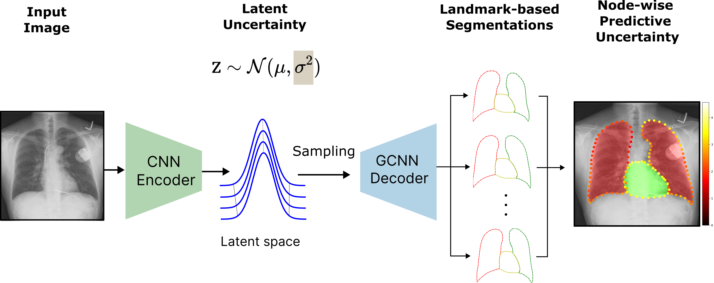

# CheXmask-U Code Repository

This repository contains the official code for the paper: *CheXmask-U: Quantifying uncertainty in landmark-based anatomical segmentation for X-ray images*. This work introduces a framework to estimate uncertainty in landmark-based segmentation models applied to chest X-rays, leveraging the HybridGNet architecture.



## Code

The code in this repository is organized into different directories:

- `Annotations/`: Contains a placeholder file for the annotations CSV files.
- `DataPreparation/`: Includes scripts for preparing the dataset, to be used with the HybridGNet if desired.
- `DataPostprocessing/`: Includes scripts to remove the pre-processing steps applied to the original chest X-ray images. Also includes scripts to convert the segmentation masks from RLE format to binary masks.
- `HybridGNet/`: Includes the code for training and using the HybridGNet supporting sampling to generate multiple output predictions.
- `RCA_ChestXRay/`: Contains scripts for evaluating the segmentation quality using the Reverse Classification Accuracy (RCA) framework and the physician studies.
- `Weights/`: Contains the HybridGNet model weights, which are now hosted on Hugging Face and can be accessed [here](https://huggingface.co/mcosarinsky/CheXmask-U/tree/main/weights).

## Quick Start: Load Pretrained Model

You can easily load the pretrained HybridGNetHF model from Hugging Face:

```python
from models.HybridGNet2IGSC import HybridGNetHF

device = "cuda"  # or "cpu"
model = HybridGNetHF.from_pretrained(
    "mcosarinsky/CheXmask-U",
    subfolder="v1_skip",
    device=device
)
```

## Dataset

As a key contribution, we release **CheXmask-U**, a large-scale dataset of 657,566 chest X-ray landmark segmentations that includes per-node uncertainty estimates for each.

These uncertainty estimates were generated by computing $N=50$ stochastic samples per image for all images in the original CheXMask dataset, using the HybridGNet model. For each landmark node, we provide the mean predicted coordinates and the standard deviation. The dataset is publicly available at: [https://huggingface.co/datasets/mcosarinsky/CheXmask-U](https://huggingface.co/datasets/mcosarinsky/CheXmask-U).

An interactive demo of the method is available at: [https://huggingface.co/spaces/mcosarinsky/CheXmask-U](https://huggingface.co/spaces/mcosarinsky/CheXmask-U).

## Requirements

To run the code in this repository, the following dependencies are required:

- Python 3
- NumPy
- Pandas
- Matplotlib
- OpenCV

To use the HybridGNet model, the following additional dependencies are required:

- PyTorch
- PyTorchGeometric

Please refer to the source code of the HybridGNet for additional information: [https://github.com/ngaggion/HybridGNet](https://github.com/ngaggion/HybridGNet).

## Citations

If you use **CheXmask-U** in your research, please cite the following:

```bibtex
@misc{cosarinsky2025chexmaskuquantifyinguncertaintylandmarkbased,
      title={CheXmask-U: Quantifying uncertainty in landmark-based anatomical segmentation for X-ray images}, 
      author={Matias Cosarinsky and Nicolas Gaggion and Rodrigo Echeveste and Enzo Ferrante},
      year={2025},
      eprint={2512.10715},
      archivePrefix={arXiv},
      primaryClass={cs.CV},
      url={https://arxiv.org/abs/2512.10715}
}
```
